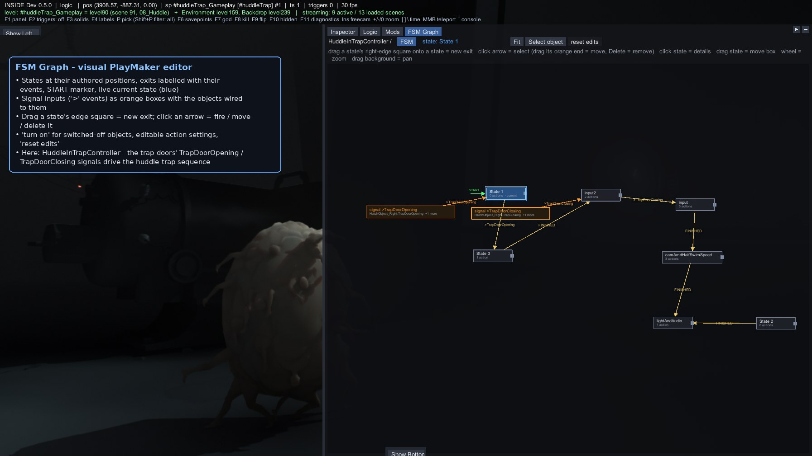
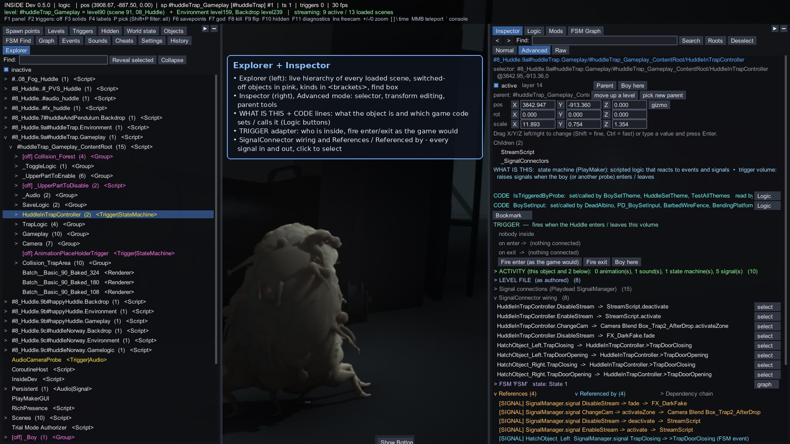
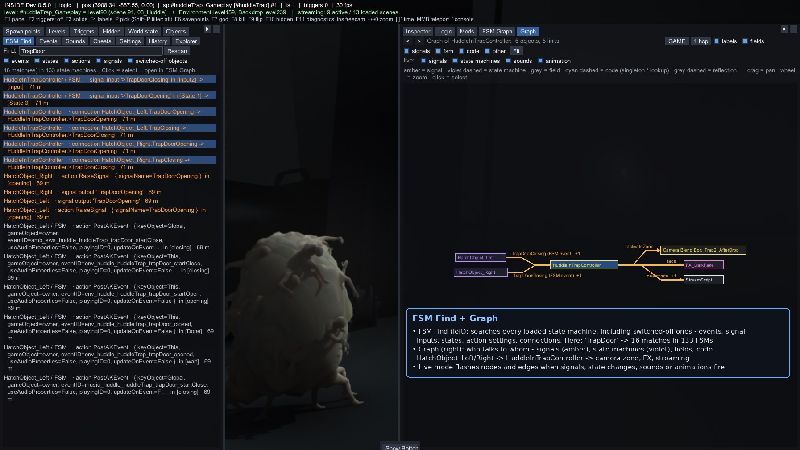
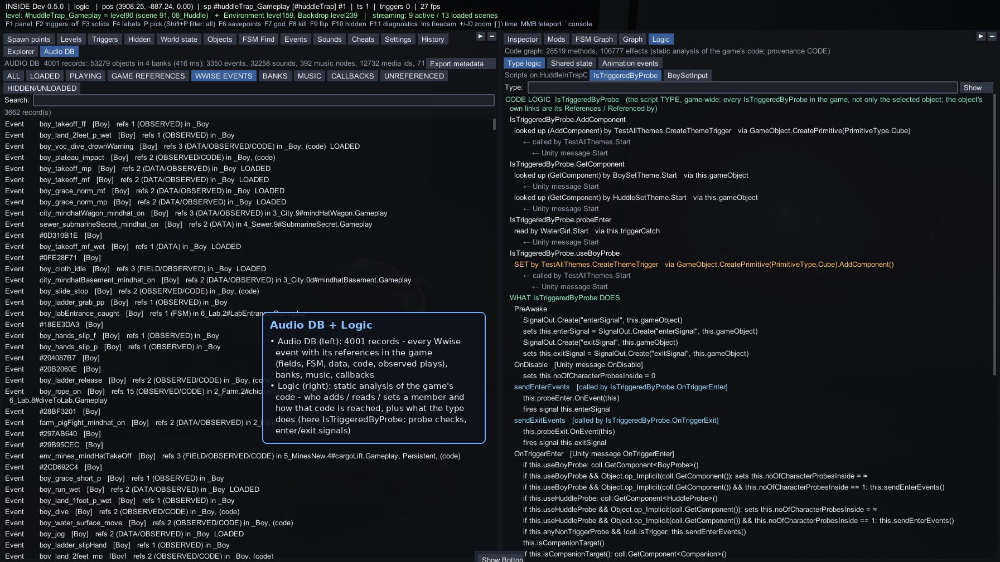
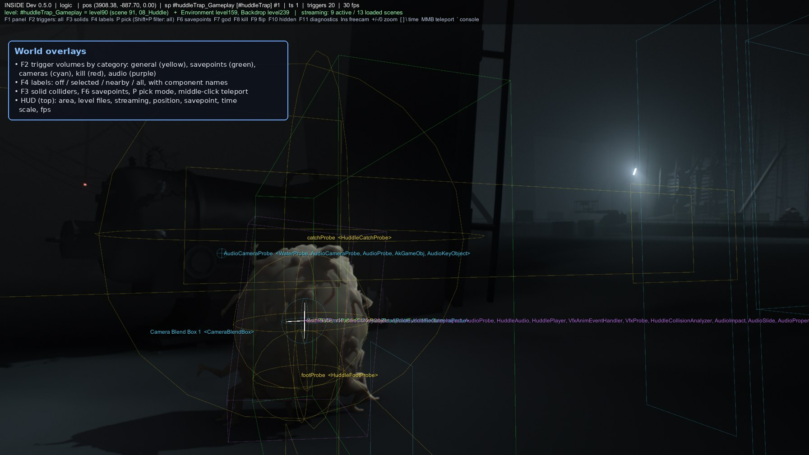
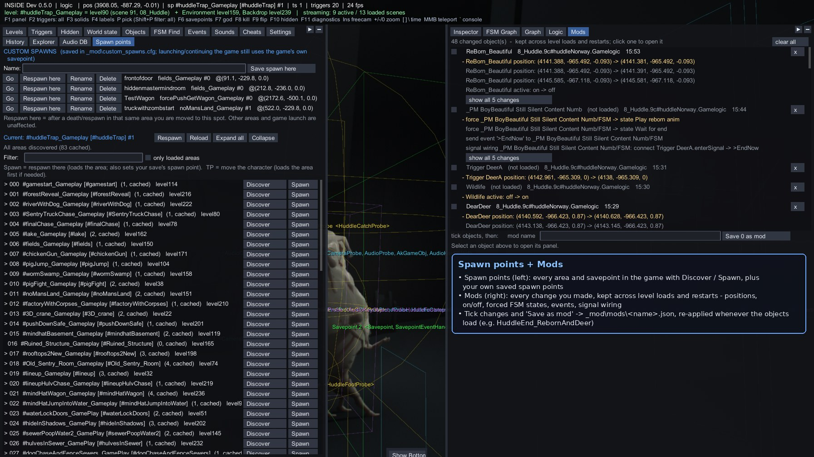
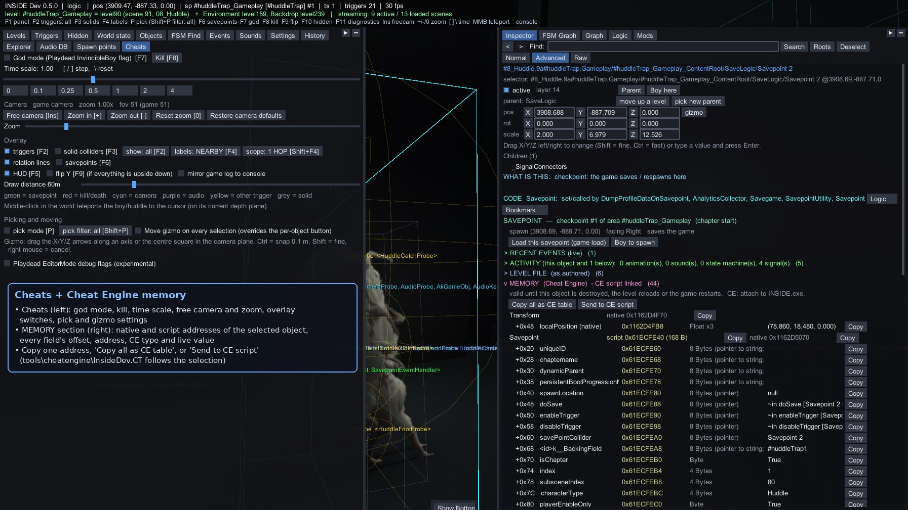
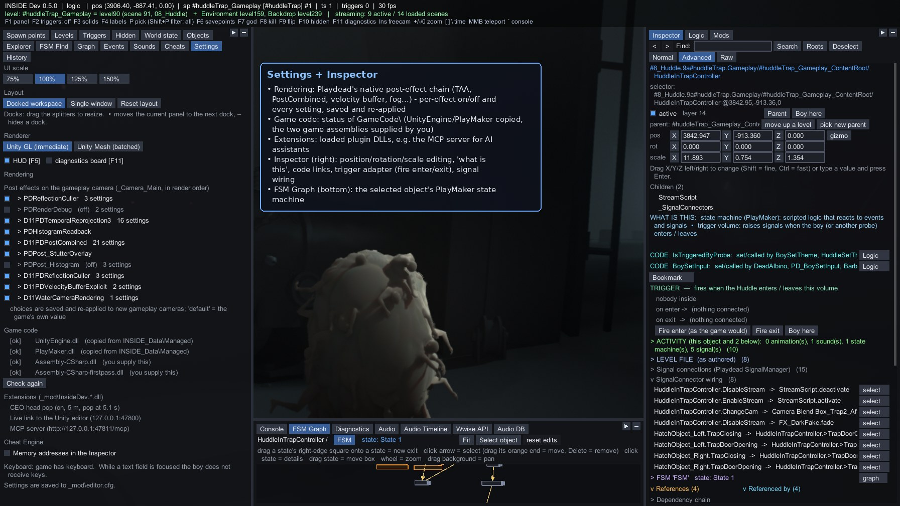

#  INSIDE runtime editor (InsideDev 0.5.0)

An in-game editor and explorer for Playdead's INSIDE (Unity 5.0.4f1): browse and edit the live scene, see how
objects, signals, PlayMaker state machines, code and audio are connected, record changes as mods, and inspect memory
with Cheat Engine.

> Unofficial fan-made tool, not affiliated with or endorsed by Playdead. INSIDE is a trademark of Playdead.
> This repository contains no game files or game code; you need your own copy of the game.

## Requirements and install

| File | Where | What it is |
|------|-------|------------|
| File in this repo | Copy to | What it is |
|------|-------|------------|
| `bin\version.dll` | game folder (next to `INSIDE.exe`) | proxy loader: forwards the real `version.dll`, boots InsideDev once the game's code has loaded |
| `bin\InsideDev.dll` | `<game>\_mod\` | the editor |
| `bin\InsideDev.Mcp.dll` | `<game>\_mod\` | optional: MCP server for AI assistants (see "AI assistants (MCP)") |
| `tools\mcp\InsideDev.McpStdio.exe` | anywhere | optional: stdio launcher for MCP clients that start a local program |
| `tools\cheatengine\InsideDev.CT` | anywhere | optional: Cheat Engine table |
| `mods\*.json` | `<game>\_mod\mods\` | optional: example mods (enable them in the Mods panel) |

Start the game normally; **F1** opens the editor. Settings, logs, mods and caches live in `<game>\_mod\`.
To uninstall, delete `version.dll` from the game folder (and `_mod\` if you want the settings gone).

### Game code (`<game>\GameCode\`)


| File | Source |
|------|--------|
| `UnityEngine.dll` | plain copy of `INSIDE_Data\Managed\UnityEngine.dll` — copied automatically if missing |
| `PlayMaker.dll` | plain copy of `INSIDE_Data\Managed\PlayMaker.dll` — copied automatically if missing |
| `Assembly-CSharp.dll` | the game's own code — **you supply it** |
| `Assembly-CSharp-firstpass.dll` | the game's own code — **you supply it** |

The game does not ship the last two as ordinary DLLs. **ExpGuiViewer does not extract, decode or dump them**, and
this project does not describe how to obtain them: dump them yourself and place them in `GameCode\`.
Until both are present, InsideDev shows a reminder above every panel (can be hidden) and a status block under
**Settings > Game code** with a "Check again" button. The in-game editor itself does not need them — it uses the
game's code from memory while the game runs. The loader never writes any game assembly to disk.

## Screenshots


<table>
<tr>
<td width="50%" valign="top"><a href="docs/screenshots/fsm-graph.jpg"></a><br><b>FSM Graph — visual PlayMaker editor</b></td>
<td width="50%" valign="top"><a href="docs/screenshots/explorer.jpg"></a><br><b>Explorer + Inspector</b></td>
</tr>
<tr>
<td width="50%" valign="top"><a href="docs/screenshots/fsmfind.jpg"></a><br><b>FSM Find + object Graph</b></td>
<td width="50%" valign="top"><a href="docs/screenshots/audio-logic.jpg"></a><br><b>Audio DB + code Logic</b></td>
</tr>
<tr>
<td width="50%" valign="top"><a href="docs/screenshots/overlays.jpg"></a><br><b>World overlays</b></td>
<td width="50%" valign="top"><a href="docs/screenshots/spawns-mods.jpg"></a><br><b>Spawn points + Mods</b></td>
</tr>
<tr>
<td width="50%" valign="top"><a href="docs/screenshots/cheats-memory.jpg"></a><br><b>Cheats + Cheat Engine memory</b></td>
<td width="50%" valign="top"><a href="docs/screenshots/settings.jpg"></a><br><b>Settings (post effects, game code, extensions)</b></td>
</tr>
</table>

## Panels

Docked workspace (left / right / bottom docks, resizable, ▸ moves a panel to the next dock) or a single window;
UI scale 75–150 %; Ctrl+V / Ctrl+C / Ctrl+Backspace in text fields (the boy gets no keys while one has focus).
Global search / command palette **Ctrl+P**, bookmarks. Beyond what the screenshots show:

- **Inspector** — Normal / Advanced / Raw modes; ACTIVITY (animations, sounds, state machines, signals below the
  selection), MATERIALS, LEVEL FILE (object vs. its level file: as authored / changed by you / changed in game);
  adapters for savepoints, PlayMaker FSMs (fire / force), animation (who plays it, play/stop, pose slider), Animator.
- **FSM Graph** — also: action settings editable (numbers, strings, bools, events, enums, on/off) with per-setting
  undo; connections to switched-off objects link when they wake up; click a hit in FSM Find to open it here.
- **Levels / Triggers / Hidden / World state / Objects** — level list, nearby triggers, objects the game switches off
  and never on (passive scanner, `_mod\hidden\`), object database search (`t:Type`, `k:kind`, hidden/active).
- **Events** — live history of signals, FSM events, sounds and animation clips, with filters.
- **Audio / Sounds / Audio Timeline / Wwise API** — sound files per event (name, codec, length; never extracted),
  "why did this play" call stacks, timeline, audition / trigger original / override, audio rules (mute, nuke,
  replace, force switch/state/RTPC), metadata export (`_mod\export\`).
- **History** — every edit with before/after; undo / redo (Ctrl+Z / Ctrl+Y), revert per property or all.
- **Mods** — `_mod\mods\<name>.json` (selectors + values, never game assets): enable/disable, dry run, validate.
- **Console / Diagnostics** — log console, render and per-subsystem cost diagnostics.

## Keys

F1 panel · F2 trigger overlay (all / general / savepoints / cameras / kill / audio) · F3 solids · F4 labels
(off / selected / nearby / all) · P pick (Shift+P filter) · F5 HUD · F6 savepoints · F7 god · F8 kill · F9 flip ·
F10 hidden · F11 diagnostics · Insert free camera · + / − / 0 zoom · [ ] \ time scale · middle mouse teleport ·
` console · Ctrl+Z / Ctrl+Y undo / redo · Ctrl+P palette.

## Cheat Engine

Turn on Settings > Cheat Engine for the Inspector's MEMORY section (see screenshot); "what is at 0x…" resolves an
address to an object/field or a code address to a method. Plugin: load `tools\cheatengine\InsideDev.CT` (or put
`InsideDev.lua` in CE's autorun) — it follows the editor's selection and adds right-click "InsideDev: what is this?" /
"which method?".

## AI assistants (MCP)

`InsideDev.Mcp.dll` is a [Model Context Protocol](https://modelcontextprotocol.io) server that runs inside the game,
so an AI assistant or any MCP client can look at and edit the live game. Tested with Claude; it follows the
standard protocol (versions 2024-11-05 to 2025-11-25), so other MCP clients should work too.

- Endpoint: `http://127.0.0.1:47811/mcp` (Streamable HTTP). It listens on this computer only, never on the network.
- For clients that start a local program (stdio), point them at `tools\mcp\InsideDev.McpStdio.exe` (needs .NET
  Framework 4.x, built into Windows). It can be connected before the game is started: until INSIDE is running it
  offers only `inside_status`, and it tells the client when the game's tools appear or go away.
- Tools: `game_state`, `screenshot` (returns the image), `show_panel` (open a panel, move it to a dock, resize the
  dock), `find_objects`, `inspect`, `select`, `set_active`, `fsm_graph`, `fsm_find`, `fsm` (send event / force
  state / variables), `signal`, `log`, and `command` (any InsideDev bridge/console command, e.g. `help`, `near 10`,
  `history`, `undo`). Edits are recorded in History.
- In game: `mcp` (status), `mcp on|off`, `mcp port <n>`, `mcp selftest` then `mcp test` (a real HTTP session
  against the endpoint). Settings > Extensions shows the endpoint.

Client setup examples:

```
Claude Code:     claude mcp add --transport http inside http://127.0.0.1:47811/mcp
Claude Desktop:  claude_desktop_config.json ->
                 { "mcpServers": { "inside": { "command": "C:\\path\\to\\InsideDev.McpStdio.exe" } } }   (escape \ as \\)
Other clients:   HTTP url http://127.0.0.1:47811/mcp, or the stdio command above (optional --port <n>)
```

## Debugger

The loader enables Mono's debugger agent on 127.0.0.1:55555, so dnSpy can attach (Debug → Attach → Unity (Connect));
`_mod\nodebugger.flag` turns it off.

## Remote bridge

The file bridge predates the MCP server and still works without it: write `_mod\cmd\in_<anything>.txt` containing
`<id>|<command>`; the answer appears in `_mod\cmd\out.txt`. `help` lists the commands (select, inspect, set,
setactive, fsm, fsmgraph, fsmfind, fsmset, sigs, sigwire, signal, graph, logic, audio, adb, mod, history, undo, mem…,
postfx, gamecode, screenshot, …). Layout from scripts: `ui put <panel> left|right|bottom`,
`ui dock <dock> <size>|on|off`, `ui window x y w h`, `ui docks`, `ui reset`.

## Building

Needs a .NET SDK (Roslyn `csc`), Mono's `mcs` for the stdio launcher and MinGW-w64 for the loader. `GAME` is the INSIDE
folder with a complete `GameCode\` (see "Game code").

```
GAME=/path/to/INSIDE sh build/build_mod.sh      # bin/InsideDev.dll
GAME=/path/to/INSIDE sh build/build_mcp.sh      # bin/InsideDev.Mcp.dll + tools/mcp/InsideDev.McpStdio.exe
sh build/build_loader.sh                        # bin/version.dll
```

## Folder layout

- `bin\` — prebuilt `version.dll`, `InsideDev.dll`, `InsideDev.Mcp.dll`
- `src\InsideDev\` — the editor; `src\mcp\` — MCP server and stdio launcher; `src\loader\` — the proxy loader
- `build\` — build scripts; `tools\` — MCP launcher, Cheat Engine table; `mods\` — example mods
- `docs\screenshots\` — the screenshots above

## Removed features

- Unity editor live link (experimental): mirrored the running game into a Unity 5.0.4 editor project. Removed due
  to severe setup and usability issues.
- Internal resolution slider (INSIDE's native post chain crashes when the camera renders to a texture and the
  engine's render-resolution call is empty in this build) and the DLSS experiment.
- Forced whole-level tour (crashed the game's own animation code); replaced by the passive hidden-item scanner.
- Assembly dumping in the loader and the game-code decode tool (see "Game code").

## License

MIT — see [LICENSE](LICENSE).
